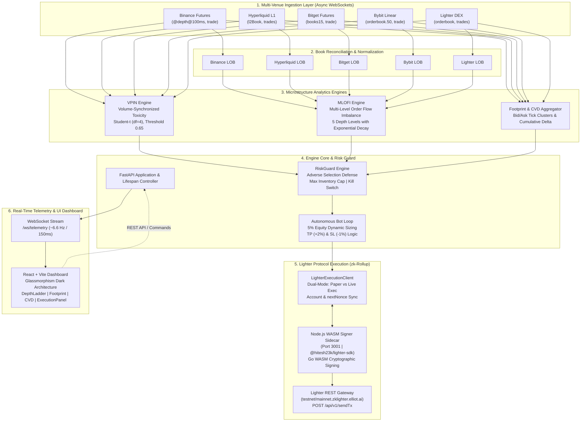

# OrderFlow HFT Engine — System Architecture

An institutional-grade, high-frequency order flow analytics and algorithmic execution engine designed for sub-second market microstructure trading across major cryptocurrency derivative exchanges and decentralized zk-Rollups (Lighter Protocol).

---

## 1. High-Level System Architecture



---

## 2. Component Specifications

### 2.1 Multi-Venue Ingestion Layer (`backend/app/ingestion/`)

Each exchange ingestor inherits from `BaseWebSocketClient` (`base.py`) which manages:
- **Asynchronous Event Loop**: Non-blocking `asyncio` transport with zero thread-switching overhead.
- **Resilient Connection Lifecycle**: Automatic reconnection with exponential backoff and jitter.
- **Heartbeat & Liveness**: Venue-specific ping/pong frames keeping sockets alive (e.g. 60s for Lighter, 20s for Bybit).
- **Atomic Depth Seeding**: Pre-buffering WebSocket diffs while fetching REST snapshots (`fapi.binance.com/fapi/v1/depth`) to prevent sequence gaps.

| Exchange | Connection Type | Channel / Topic | Latency Target |
| :--- | :--- | :--- | :--- |
| **Binance Futures** | WebSocket Stream | `btcusdt@depth@100ms`, `btcusdt@trade` | ~10-25ms |
| **Hyperliquid L1** | WebSocket | `l2Book` (market: BTC), `trades` | ~15-30ms |
| **Bitget Futures** | WebSocket v2 | `books15`, `trade` (BTCUSDT) | ~20-40ms |
| **Bybit Linear** | WebSocket v5 | `orderbook.50`, `publicTrade` | ~20-35ms |
| **Lighter Protocol** | zk-Rollup WebSocket | `orderbook`, `trades` | ~30-50ms |

---

### 2.2 Microstructure Analytics Engines (`backend/app/analytics/`)

#### 1. Limit Order Book (`orderbook.py`)
- Maintains discrete Bid and Ask price ladders sorted by priority.
- Updates levels in $O(\log N)$ with instantaneous top-of-book and cumulative depth extraction up to level 50.
- Implements checksum validation and best-bid-offer (BBO) spread calculations.

#### 2. VPIN Engine — Toxicity Metric (`vpin.py`)
- **Volume-Synchronized Probability of Toxicity** classifies order flow into volume buckets of fixed size $V$ (default: `2.0 BTC`).
- Classifies trade volume into buy volume $V_\tau^B$ and sell volume $V_\tau^S$ using tick-rule trade classification.
- Computes empirical toxicity over a rolling window of $N=50$ buckets:
  $$\text{VPIN} = \frac{\sum_{\tau=1}^N |V_\tau^B - V_\tau^S|}{N \times V}$$
- Evaluates CDF values under a Student's $t$-distribution ($\nu=4$ degrees of freedom) to detect heavy-tailed informed trading spikes.
- **Toxicity Threshold**: When $\text{VPIN} > 0.65$, adverse selection risk is triggered and passive orders are halted immediately.

#### 3. MLOFI Engine — Multi-Level Order Flow Imbalance (`mlofi.py`)
- Analyzes order book queue fluctuations across the top 5 levels:
  $$I_t^{(i)} = \Delta Q_{b,t}^{(i)} - \Delta Q_{a,t}^{(i)}$$
- Computes depth-weighted integrated imbalance with exponential decay parameter $\lambda = 0.4$:
  $$w_i = e^{-\lambda (i-1)}, \quad \text{MLOFI}_t = \frac{\sum_{i=1}^k w_i I_t^{(i)}}{\sum_{i=1}^k w_i}$$
- An integrated imbalance $> +0.05$ indicates strong institutional buying pressure; $< -0.05$ indicates strong selling pressure.

#### 4. Footprint & Cumulative Volume Delta (CVD) (`footprint.py`)
- Aggregates trades into time-sliced footprint bars (5-second intervals).
- Groups trades into discrete price ticks, tracking volume executed at Bid vs Ask.
- Maintains Cumulative Volume Delta: $\text{CVD}_t = \text{CVD}_{t-1} + (V_{\text{taker\_buy}} - V_{\text{taker\_sell}})$.

---

### 2.3 Risk Guard & Autonomous Trading Bot (`backend/app/main.py`)

#### Risk Management Guard (`risk_guard.py`)
1. **Adverse Selection Protection**: Halts all passive quoting when VPIN exceeds `0.65`.
2. **Inventory Risk Cap**: Enforces a strict maximum net position limit (e.g. max `0.5 BTC`).
3. **Hardware Kill-Switch**: Instantly cancels all pending orders and liquidates positions on trigger.
4. **Self-Trade Prevention (STP)**: Prevents crossing self-orders to comply with exchange rules.

#### Autonomous Execution Loop
- **Cycle Frequency**: Runs on a 1.0-second asynchronous evaluation loop.
- **Position Sizing**: Strictly **5% of total equity** per trade:
  $$\text{Amount} = \frac{\text{Equity}_{\text{USD}} \times 0.05}{\text{Price}}$$
- **Automated Profit & Loss Targets**:
  - **Take-Profit (TP)**: Target limit order placed at **+2%** from entry price with `reduce_only=True`.
  - **Stop-Loss (SL)**: Monitored at **-1%** from entry price.
- **Order Expiration & Stale Order Cancellation**: Unfilled orders have periodic random expiration pruning to keep the book clean.

---

### 2.4 Lighter Protocol Execution Client (`backend/app/execution/`)

#### Dual-Mode Architecture
- **Paper Trading Mode**: Local memory simulation providing full order lifecycle fills and PnL simulation against live exchange feeds.
- **Live zk-Rollup Execution Mode**: Signs and broadcasts real orders directly to Lighter Exchange (Testnet: Chain ID `300` / Mainnet: Chain ID `304`).

#### Node.js WASM Signer Sidecar (`backend/signer/index.js`)
Lighter transactions require cryptographic zk-SNARK friendly signatures generated via Go WASM (`@hitesh23k/lighter-sdk`):
- Runs as a local daemon on `http://127.0.0.1:3001`.
- Exposes REST endpoints:
  - `POST /sign_create_order`
  - `POST /sign_cancel_order`
  - `POST /sign_cancel_all_orders`
  - `POST /sign_update_leverage`
- Automatically scales floating-point prices and amounts to uint48 integers based on `price_decimals` and `amount_decimals` dynamically retrieved from `GET /api/v1/orderBookDetails`.
- Maintains strict monotonic nonce serialization synced with `GET /api/v1/nextNonce`.

---

### 2.5 Real-Time Frontend Dashboard (`frontend/src/`)

Built with React 19, Vite, and custom CSS Design System with Glassmorphism aesthetic.

```
frontend/src/
├── App.jsx                  # WebSocket client & centralized state store
├── index.css                # Obsidian/Cyan/Rose Glassmorphism design tokens
└── components/
    ├── Header.jsx           # Global status, latency, kill switch
    ├── MetricsBar.jsx       # VPIN gauge, MLOFI meter, CVD delta
    ├── FootprintChart.jsx   # Interactive bid/ask volume cluster bars
    ├── CvdChart.jsx         # Real-time HTML5 Canvas CVD line graph
    ├── DepthLadder.jsx      # Multi-venue L2 orderbook with depth bars
    └── ExecutionPanel.jsx   # Bot controls, mode toggles, leverage slider, account editor
```

#### Key Dashboard Capabilities:
- **Live Sync & Account Switcher**: Real-time display of Lighter Account Index and live synchronized equity from zk-Rollup state.
- **Testnet / Mainnet Toggle**: One-click dynamic switching between Testnet and Live Mainnet without server reboot.
- **Paper vs Live Execution Switch**: Instant toggle between simulated paper trading and real on-chain execution.
- **Cross Leverage Control Slider**: Real-time adjustment of cross margin leverage from 1x to 50x.
- **Zero-Polling WebSockets**: High-frequency telemetry stream pushed at 6.6 Hz (~150ms).

---

## 3. Directory Structure

```
OrderFlow/
├── ARCHITECTURE.md                  # This document
├── backend/
│   ├── .env                         # Secure configuration (API keys, account index)
│   ├── .env.example                 # Environment template
│   ├── requirements.txt             # Python dependencies (FastAPI, uvicorn, httpx, etc.)
│   ├── run.py                       # Unified backend launcher (Node signer + Uvicorn)
│   ├── app/
│   │   ├── main.py                  # FastAPI entrypoint, WebSocket broadcaster, bot loop
│   │   ├── analytics/
│   │   │   ├── footprint.py         # Footprint chart & CVD calculation
│   │   │   ├── mlofi.py             # Multi-Level Order Flow Imbalance
│   │   │   ├── orderbook.py         # In-memory Limit Order Book
│   │   │   └── vpin.py              # Volume-Synchronized Probability of Toxicity
│   │   ├── execution/
│   │   │   ├── lighter_client.py    # Lighter Protocol execution client
│   │   │   └── risk_guard.py        # Microstructure risk management
│   │   └── ingestion/
│   │       ├── base.py              # Resilient WebSocket base class
│   │       ├── binance.py           # Binance Futures ingestor
│   │       ├── bitget.py            # Bitget Futures ingestor
│   │       ├── bybit.py             # Bybit Linear ingestor
│   │       ├── hyperliquid.py       # Hyperliquid L1 ingestor
│   │       └── lighter.py           # Lighter Protocol ingestor
│   └── signer/
│       ├── package.json             # Signer dependencies (@hitesh23k/lighter-sdk, express)
│       └── index.js                 # Express microservice wrapping WASM signer
└── frontend/
    ├── package.json                 # Frontend dependencies (React, Vite, Lucide)
    ├── vite.config.js               # Vite build configuration
    └── src/
        ├── App.jsx                  # Telemetry consumer & root view
        ├── main.jsx                 # React root renderer
        ├── index.css                # Glassmorphism dark mode styles
        └── components/              # Modular UI components
```

---

## 4. Telemetry WebSocket Payload Schema

The backend broadcasts telemetry packets at ~6.6 Hz over `/ws/telemetry`:

```json
{
  "type": "TELEMETRY_UPDATE",
  "timestamp": 1790860500.123,
  "orderbooks": {
    "binance": { "bids": [[83750.0, 1.25], ...], "asks": [[83750.1, 0.95], ...] },
    "hyperliquid": { "bids": [...], "asks": [...] },
    "bitget": { "bids": [...], "asks": [...] },
    "bybit": { "bids": [...], "asks": [...] },
    "lighter": { "bids": [...], "asks": [...] }
  },
  "vpin": {
    "current_vpin": 0.32,
    "cdf": 0.45,
    "is_toxic": false,
    "toxicity_threshold": 0.65
  },
  "mlofi": {
    "imbalance": 0.12,
    "spread": 0.10,
    "mid_price": 83750.05
  },
  "cvd": {
    "current_cvd": 145.2,
    "delta_1m": 12.4
  },
  "footprint_bars": [ ... ],
  "execution": {
    "account_index": 275,
    "mode": "TESTNET",
    "is_simulation": false,
    "is_account_synced": true,
    "equity_usd": 10000.0,
    "position": 0.0,
    "unrealized_pnl": 0.0,
    "open_orders_count": 0,
    "open_orders": []
  },
  "risk": {
    "kill_switch_active": false,
    "passive_quoting_paused": false
  },
  "connections": {
    "binance": { "connected": true, "ping_ms": 14 },
    "hyperliquid": { "connected": true, "ping_ms": 22 },
    "lighter": { "connected": true, "ping_ms": 31 }
  },
  "bot_active": true,
  "bot_logs": [ ... ]
}
```

---

## 5. Quick Start & Execution

### 1. Prerequisites
- Python 3.10+
- Node.js 18+
- npm / npx

### 2. Launch Backend (API + Ingestors + Node Signer)
```bash
cd backend
# Create virtual environment if needed
python3 -m venv venv
./venv/bin/pip install -r requirements.txt

# Install Signer Microservice dependencies
cd signer && npm install && cd ..

# Launch unified engine
./venv/bin/python run.py
```

### 3. Launch Frontend Dashboard
```bash
cd frontend
npm install
npm run dev
```

Dashboard is accessible at: **`http://localhost:5173`**  
Backend API & WebSocket at: **`http://localhost:8000`**  
WASM Signer at: **`http://localhost:3001`**
